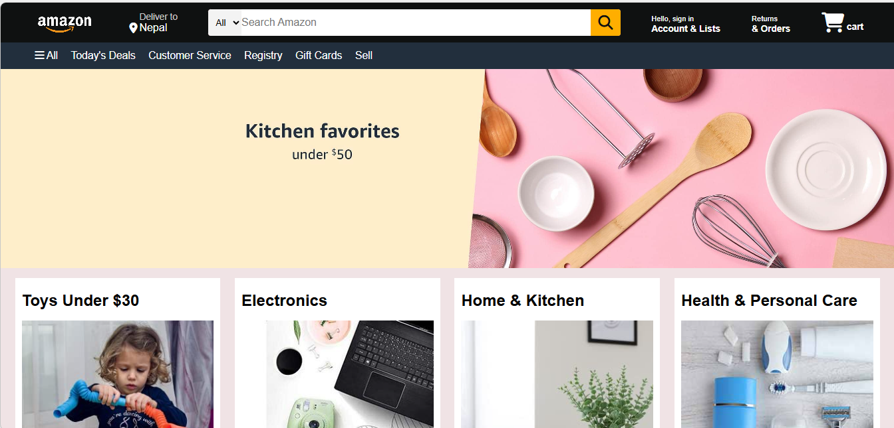

Amazon clone💻

A responsive Amazon homepage clone built using pure HTML and CSS.
This project focuses on layout design, styling, and UI structure, closely mimicking the look and feel of Amazon’s website.

🔥 Features
 Amazon-style navigation bar
 
 Search bar with category dropdown

 Product sections and cards
 
 Promotional banners
 
 Responsive design (works on different screen sizes)
 
 Clean and modern UI using CSS
 

🛠️ Technologies Used
HTML5 – Page structure

CSS3 – Styling and layout

Flexbox

Grid

Media Queries

📌 Purpose of the Project
This project was created to:

Practice HTML & CSS fundamentals

Improve frontend layout skills

Understand real-world website UI design

Build a portfolio-ready project
